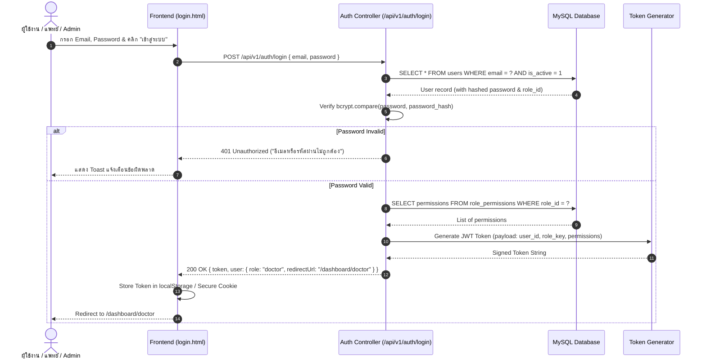
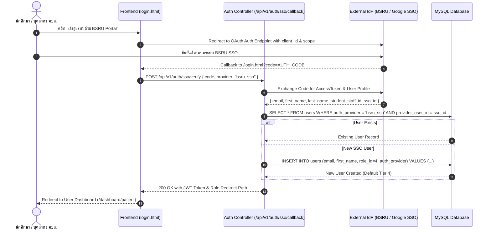

# Role-Based Access Control (RBAC) & System Architecture Specification

**System Name**: Traditional Thai Medicine Clinic System (*ระบบการจองและบริหารจัดการคลินิกการแพทย์แผนไทย มหาวิทยาลัยราชภัฏบ้านสมเด็จเจ้าพระยา*)

---

## 1. User Tier Matrix & Privilege Hierarchy

The system defines 4 distinct operational tiers to satisfy security isolation, privacy regulations (PDPA/HIPAA medical confidentiality), and clinical governance.

| User Tier | Role Key | Role Name (TH) | Core Privileges & Target Routes |
|---|---|---|---|
| **Tier 1** | `admin` | ผู้ดูแลระบบ | **Full System Access** (`/dashboard/admin`)<br>- Global system config & operating hours setup<br>- Comprehensive financial, patient, and booking analytics<br>- Doctor & Intern staff account management<br>- Oversee, override, and reassign all bookings |
| **Tier 2** | `doctor` | แพทย์แผนไทย | **Clinical Management Access** (`/dashboard/doctor`)<br>- Manage personal duty shift & treatment schedule<br>- Access patient Electronic Medical Records (EMR)<br>- Perform elemental diagnosis & record treatment logs<br>- Prescribe herbal remedies & approve intern notes |
| **Tier 3** | `intern` | นักศึกษาฝึกงาน | **Assistance & Intake Access** (`/dashboard/intern`)<br>- View daily assigned massage & therapy bookings<br>- Perform patient vital sign & preliminary intake<br>- Read-only access to assigned patient history<br>- Input draft treatment logs for doctor review |
| **Tier 4** | `user` | ผู้ใช้งานทั่วไป / นักศึกษา | **Self-Service Patient Access** (`/dashboard/patient`)<br>- Browse therapy packages & book appointment slots<br>- Manage personal profile & health preferences<br>- View personal booking status & treatment history<br>- Cancel or reschedule eligible bookings |

---

## 2. Relational Database Schema (SQL Data Definition)

The database design uses a relational schema (MySQL 8.0+ / PostgreSQL 15+) with Strict Foreign Key Constraints, Cascading Actions, and Indexed Query Paths.

```sql
-- 1. Roles Table
CREATE TABLE roles (
    id INT AUTO_INCREMENT PRIMARY KEY,
    role_key VARCHAR(50) NOT NULL UNIQUE,
    name_th VARCHAR(100) NOT NULL,
    description TEXT,
    created_at TIMESTAMP DEFAULT CURRENT_TIMESTAMP
) ENGINE=InnoDB DEFAULT CHARSET=utf8mb4 COLLATE=utf8mb4_unicode_ci;

-- 2. Permissions Table
CREATE TABLE permissions (
    id INT AUTO_INCREMENT PRIMARY KEY,
    permission_key VARCHAR(100) NOT NULL UNIQUE, -- e.g., 'booking:write', 'emr:read', 'system:config'
    module VARCHAR(50) NOT NULL,
    description TEXT
) ENGINE=InnoDB DEFAULT CHARSET=utf8mb4 COLLATE=utf8mb4_unicode_ci;

-- 3. Role-Permissions Join Table
CREATE TABLE role_permissions (
    role_id INT NOT NULL,
    permission_id INT NOT NULL,
    PRIMARY KEY (role_id, permission_id),
    FOREIGN KEY (role_id) REFERENCES roles(id) ON DELETE CASCADE,
    FOREIGN KEY (permission_id) REFERENCES permissions(id) ON DELETE CASCADE
) ENGINE=InnoDB DEFAULT CHARSET=utf8mb4 COLLATE=utf8mb4_unicode_ci;

-- 4. Central Users Master Table
CREATE TABLE users (
    id INT AUTO_INCREMENT PRIMARY KEY,
    first_name VARCHAR(100) NOT NULL,
    last_name VARCHAR(100) NOT NULL,
    email VARCHAR(150) NOT NULL UNIQUE,
    phone VARCHAR(20) NOT NULL,
    password_hash VARCHAR(255) NULL, -- Nullable for SSO OAuth users
    student_staff_id VARCHAR(50) NULL, -- Optional BSRU University ID
    role_id INT NOT NULL DEFAULT 4, -- Defaults to Tier 4 (user)
    auth_provider ENUM('local', 'bsru_sso', 'google', 'line') DEFAULT 'local',
    provider_user_id VARCHAR(255) NULL, -- External SSO User ID
    is_active TINYINT(1) DEFAULT 1,
    last_login_at TIMESTAMP NULL,
    created_at TIMESTAMP DEFAULT CURRENT_TIMESTAMP,
    updated_at TIMESTAMP DEFAULT CURRENT_TIMESTAMP ON UPDATE CURRENT_TIMESTAMP,
    FOREIGN KEY (role_id) REFERENCES roles(id),
    INDEX idx_user_email (email),
    INDEX idx_auth_provider (auth_provider, provider_user_id)
) ENGINE=InnoDB DEFAULT CHARSET=utf8mb4 COLLATE=utf8mb4_unicode_ci;

-- 5. Doctors Detail Profile Table (Tier 2)
CREATE TABLE doctors (
    id INT AUTO_INCREMENT PRIMARY KEY,
    user_id INT NOT NULL UNIQUE,
    license_no VARCHAR(100) NOT NULL UNIQUE, -- ใบประกอบโรคศิลปะ
    academic_title VARCHAR(100) DEFAULT 'อาจารย์แพทย์แผนไทย',
    specialization VARCHAR(255) DEFAULT 'หัตถการบำบัด & การปรับสมดุลธาตุ',
    is_on_duty TINYINT(1) DEFAULT 1,
    FOREIGN KEY (user_id) REFERENCES users(id) ON DELETE CASCADE
) ENGINE=InnoDB DEFAULT CHARSET=utf8mb4 COLLATE=utf8mb4_unicode_ci;

-- 6. Patients Medical Profile Table (Tier 4 Extended)
CREATE TABLE patients (
    id INT AUTO_INCREMENT PRIMARY KEY,
    user_id INT NOT NULL UNIQUE,
    blood_type VARCHAR(5) NULL,
    primary_element ENUM('ดิน', 'น้ำ', 'ลม', 'ไฟ') NULL, -- ธาตุเจ้าเรือนประจำตัว
    underlying_conditions TEXT NULL, -- โรคประจำตัว / การแพ้ยา
    emergency_contact_name VARCHAR(150) NULL,
    emergency_contact_phone VARCHAR(20) NULL,
    FOREIGN KEY (user_id) REFERENCES users(id) ON DELETE CASCADE
) ENGINE=InnoDB DEFAULT CHARSET=utf8mb4 COLLATE=utf8mb4_unicode_ci;

-- 7. Bookings Master Table
CREATE TABLE bookings (
    id INT AUTO_INCREMENT PRIMARY KEY,
    booking_code VARCHAR(20) NOT NULL UNIQUE, -- e.g., BSRU-20260803-042
    patient_id INT NOT NULL,
    doctor_id INT NULL, -- Assigned Doctor
    intern_id INT NULL, -- Assigned Intern Assistant
    service_name VARCHAR(150) NOT NULL,
    package_name VARCHAR(150) NULL,
    booking_date DATE NOT NULL,
    time_slot VARCHAR(10) NOT NULL, -- e.g. '09:00', '10:30'
    price DECIMAL(10, 2) NOT NULL,
    status ENUM('pending', 'confirmed', 'in_progress', 'completed', 'cancelled') DEFAULT 'pending',
    patient_notes TEXT NULL,
    created_at TIMESTAMP DEFAULT CURRENT_TIMESTAMP,
    FOREIGN KEY (patient_id) REFERENCES patients(id),
    FOREIGN KEY (doctor_id) REFERENCES doctors(id) ON DELETE SET NULL,
    INDEX idx_booking_date_slot (booking_date, time_slot)
) ENGINE=InnoDB DEFAULT CHARSET=utf8mb4 COLLATE=utf8mb4_unicode_ci;

-- 8. Clinical Treatment Records / EMR Logs
CREATE TABLE treatment_records (
    id INT AUTO_INCREMENT PRIMARY KEY,
    booking_id INT NOT NULL UNIQUE,
    patient_id INT NOT NULL,
    doctor_id INT NOT NULL,
    intern_id INT NULL,
    pulse_rate VARCHAR(20) NULL, -- การจับชีพจร (ตับ, ไต, หัวใจ)
    elemental_diagnosis TEXT NOT NULL, -- วินิจฉัยธาตุเจ้าเรือนที่เสียสมดุล
    symptoms_observed TEXT NOT NULL,
    treatment_details TEXT NOT NULL, -- รายละเอียดการนวด/ประคบ/เผายา
    herbs_prescribed TEXT NULL, -- ยาสมุนไพรที่จ่าย
    doctor_notes TEXT NULL,
    is_approved_by_doctor TINYINT(1) DEFAULT 1,
    created_at TIMESTAMP DEFAULT CURRENT_TIMESTAMP,
    FOREIGN KEY (booking_id) REFERENCES bookings(id),
    FOREIGN KEY (patient_id) REFERENCES patients(id),
    FOREIGN KEY (doctor_id) REFERENCES doctors(id)
) ENGINE=InnoDB DEFAULT CHARSET=utf8mb4 COLLATE=utf8mb4_unicode_ci;

-- Seed Default Roles
INSERT INTO roles (id, role_key, name_th, description) VALUES
(1, 'admin', 'ผู้ดูแลระบบ', 'ผู้ดูแลระบบสูงสุด'),
(2, 'doctor', 'แพทย์แผนไทย', 'อาจารย์แพทย์แผนไทยวิชาชีพ'),
(3, 'intern', 'นักศึกษาฝึกงาน', 'นักศึกษาผู้ช่วยแพทย์แผนไทย'),
(4, 'user', 'ผู้ใช้งานทั่วไป / นักศึกษา', 'ผู้รับบริการทั่วไปและนักศึกษา มบส.');
```

---

## 3. JWT Claims & Token Payload Specification

Upon successful authentication (via password check or OAuth callback verification), the backend signs an HTTP-Only Secure JWT (JSON Web Token) with standard claims and custom RBAC metadata:

### JWT Header
```json
{
  "alg": "HS256",
  "typ": "JWT"
}
```

### JWT Payload
```json
{
  "sub": "user_id_1024",
  "iss": "https://thaimed.bsru.ac.th",
  "aud": "bsru_thaimed_app",
  "iat": 1785759000,
  "exp": 1785845400,
  "user": {
    "id": 1024,
    "email": "doctor.nattawut@bsru.ac.th",
    "first_name": "ณัฐวุฒิ",
    "last_name": "สุวรรณเวช",
    "student_staff_id": "EMP-8812",
    "role": {
      "id": 2,
      "key": "doctor",
      "name_th": "แพทย์แผนไทย"
    },
    "permissions": [
      "emr:read",
      "emr:write",
      "schedule:manage",
      "prescription:write"
    ],
    "auth_provider": "bsru_sso"
  }
}
```

---

## 4. Middleware Guard Pseudo-Code & Role Routing Engine

### Backend Authentication Guard (`middleware/authGuard.js`)
```javascript
const jwt = require('jsonwebtoken');

// 1. Verify Authentication Token
function authenticateToken(req, res, next) {
  const authHeader = req.headers['authorization'];
  const token = authHeader && authHeader.split(' ')[1]; // Bearer <token>

  if (!token) {
    return res.status(401).json({ status: 401, message: 'กรุณาเข้าสู่ระบบก่อนใช้งาน' });
  }

  jwt.verify(token, process.env.JWT_SECRET_KEY, (err, decodedUser) => {
    if (err) {
      return res.status(403).json({ status: 403, message: 'Session หมดอายุ กรุณาเข้าสู่ระบบใหม่' });
    }
    req.user = decodedUser.user;
    next();
  });
}

// 2. Authorize Specific Roles (RBAC Check)
function authorizeRoles(...allowedRoles) {
  return (req, res, next) => {
    if (!req.user || !allowedRoles.includes(req.user.role.key)) {
      return res.status(403).json({
        status: 403,
        message: `ปฏิเสธการเข้าถึง: สิทธิ์ระดับ "${req.user.role.name_th}" ไม่สามารถเข้าถึงส่วนนี้ได้`
      });
    }
    next();
  };
}

// 3. Dynamic Router Map
const roleRouteRedirectMap = {
  'admin': '/dashboard/admin',
  'doctor': '/dashboard/doctor',
  'intern': '/dashboard/intern',
  'user': '/dashboard/patient'
};

function getRedirectPathForUser(userRoleKey) {
  return roleRouteRedirectMap[userRoleKey] || '/dashboard/patient';
}

module.exports = { authenticateToken, authorizeRoles, getRedirectPathForUser };
```

---

## 5. Sequence Diagrams

### Diagram 1: Local Credential Login & Dynamic RBAC Routing



### Diagram 2: Third-Party SSO / OAuth 2.0 Authentication Flow (Google / BSRU Portal)


